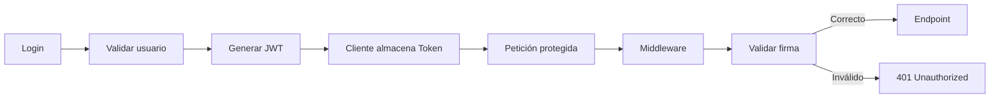
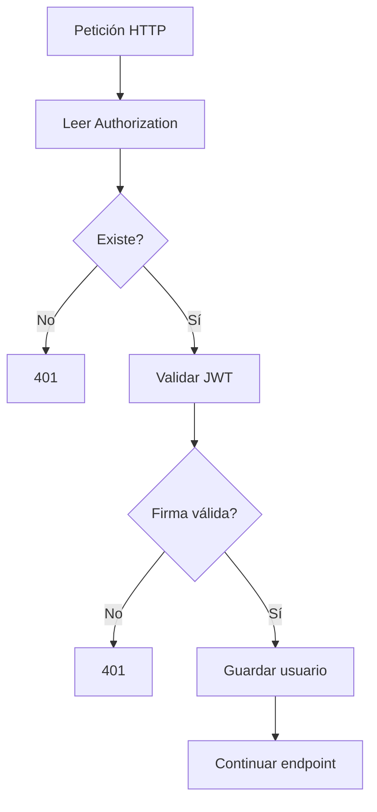

# 🔐 JWT Authentication en Golang: implementación completa para APIs seguras


Cuando una API comienza a ser utilizada por aplicaciones web, móviles o servicios internos, tarde o temprano aparece la misma necesidad: identificar quién realiza cada petición sin mantener sesiones en memoria.

Ahí es donde JWT (JSON Web Token) suele convertirse en una de las soluciones más utilizadas. Su principal ventaja es que el servidor no necesita almacenar el estado de cada usuario autenticado. Cada petición lleva consigo la información necesaria para validar la identidad del cliente.

Aunque el concepto parece sencillo, una implementación incorrecta puede introducir vulnerabilidades difíciles de detectar. Es común encontrar APIs que aceptan cualquier algoritmo de firma, tokens sin expiración o secretos expuestos en el repositorio.

Este artículo desarrolla una implementación completa utilizando Go, explicando qué ocurre en cada etapa y mostrando una estructura fácil de mantener.

---

# ¿Qué problema resuelve JWT?

Imaginemos una API que administra pedidos.

Sin autenticación cualquier persona podría ejecutar:

```
GET /orders
DELETE /orders/15
POST /orders
```

No existe forma de saber quién realizó la petición.

Con JWT el flujo cambia.

```text
Usuario
   │
   │ Login
   ▼
Servidor
   │
   │ Genera JWT firmado
   ▼
Cliente
   │
   │ Authorization: Bearer <token>
   ▼
API
   │
   │ Verifica firma
   ▼
Acceso permitido
```

El token contiene información del usuario y una firma digital que impide modificarlo sin conocer la clave secreta.

---

# Flujo completo



---

# Estructura del proyecto

```
jwt-api/

├── main.go
├── handlers
│   └── auth.go
├── middleware
│   └── jwt.go
├── models
│   └── user.go
├── utils
│   └── jwt.go
├── go.mod
```

La separación evita mezclar lógica de autenticación con la lógica del negocio.

---

# Instalación

Inicializamos el proyecto.

```bash
go mod init jwt-api
```

Instalamos las dependencias.

```bash
go get github.com/golang-jwt/jwt/v5
go get github.com/gin-gonic/gin
```

---

# Definiendo el modelo

```go
package models

type User struct {
	ID       int
	Username string
	Password string
}
```

Para simplificar el ejemplo utilizaremos un usuario fijo.

En un proyecto real estos datos provendrían de una base de datos y la contraseña estaría almacenada con bcrypt.

---

# Generando un JWT

Creamos `utils/jwt.go`

```go
package utils

import (
	"time"

	"github.com/golang-jwt/jwt/v5"
)

var SecretKey = []byte("super-secret-key")

type Claims struct {
	UserID int `json:"user_id"`
	jwt.RegisteredClaims
}

func GenerateToken(userID int) (string, error) {

	claims := Claims{
		UserID: userID,
		RegisteredClaims: jwt.RegisteredClaims{
			ExpiresAt: jwt.NewNumericDate(time.Now().Add(2 * time.Hour)),
			IssuedAt:  jwt.NewNumericDate(time.Now()),
		},
	}

	token := jwt.NewWithClaims(jwt.SigningMethodHS256, claims)

	return token.SignedString(SecretKey)
}
```

El token incluirá:

- ID del usuario
- Fecha de emisión
- Fecha de expiración

La firma se realiza utilizando HS256.

---

# Login

Creamos `handlers/auth.go`

```go
package handlers

import (
	"net/http"

	"github.com/gin-gonic/gin"

	"jwt-api/utils"
)

type LoginRequest struct {
	Username string `json:"username"`
	Password string `json:"password"`
}

func Login(c *gin.Context) {

	var req LoginRequest

	if err := c.ShouldBindJSON(&req); err != nil {

		c.JSON(http.StatusBadRequest, gin.H{
			"error": "JSON inválido",
		})

		return
	}

	if req.Username != "admin" || req.Password != "123456" {

		c.JSON(http.StatusUnauthorized, gin.H{
			"error": "Credenciales inválidas",
		})

		return
	}

	token, err := utils.GenerateToken(1)

	if err != nil {

		c.JSON(http.StatusInternalServerError, gin.H{
			"error": err.Error(),
		})

		return
	}

	c.JSON(http.StatusOK, gin.H{
		"token": token,
	})
}
```

Una vez autenticado el usuario se devuelve un JWT.

Respuesta:

```json
{
  "token": "eyJhbGciOiJIUzI1NiIs..."
}
```

---

# Middleware para validar el token

Creamos `middleware/jwt.go`

```go
package middleware

import (
	"net/http"
	"strings"

	"github.com/gin-gonic/gin"
	"github.com/golang-jwt/jwt/v5"

	"jwt-api/utils"
)

func JWTMiddleware() gin.HandlerFunc {

	return func(c *gin.Context) {

		auth := c.GetHeader("Authorization")

		if auth == "" {

			c.AbortWithStatusJSON(http.StatusUnauthorized, gin.H{
				"error": "Token requerido",
			})

			return
		}

		tokenString := strings.TrimPrefix(auth, "Bearer ")

		token, err := jwt.ParseWithClaims(
			tokenString,
			&utils.Claims{},
			func(token *jwt.Token) (interface{}, error) {
				return utils.SecretKey, nil
			},
		)

		if err != nil || !token.Valid {

			c.AbortWithStatusJSON(http.StatusUnauthorized, gin.H{
				"error": "Token inválido",
			})

			return
		}

		c.Next()
	}
}
```

Este middleware intercepta todas las peticiones protegidas antes de que lleguen al controlador.

---

# Endpoint protegido

```go
func Profile(c *gin.Context) {

	c.JSON(200, gin.H{
		"message": "Acceso autorizado",
	})
}
```

---

# Configurando Gin

```go
package main

import (
	"github.com/gin-gonic/gin"

	"jwt-api/handlers"
	"jwt-api/middleware"
)

func main() {

	router := gin.Default()

	router.POST("/login", handlers.Login)

	protected := router.Group("/api")

	protected.Use(middleware.JWTMiddleware())

	{
		protected.GET("/profile", handlers.Profile)
	}

	router.Run(":8080")
}
```

---

# Probando el login

Petición:

```http
POST /login
```

Body:

```json
{
  "username": "admin",
  "password": "123456"
}
```

Respuesta:

```json
{
  "token":"eyJhbGc..."
}
```

---

# Consumir un endpoint protegido

```http
GET /api/profile
```

Header:

```text
Authorization: Bearer eyJhbGc...
```

Respuesta:

```json
{
    "message":"Acceso autorizado"
}
```

---

# ¿Qué contiene realmente un JWT?

Un JWT posee tres partes.

```
HEADER.PAYLOAD.SIGNATURE
```

Ejemplo:

```
xxxxx.yyyyy.zzzzz
```

Header

```json
{
  "alg":"HS256",
  "typ":"JWT"
}
```

Payload

```json
{
   "user_id":1,
   "exp":1740000000
}
```

Signature

```
HMACSHA256(
 base64(header)+ "." + base64(payload),
 secret
)
```

La firma garantiza que nadie pueda modificar el contenido sin conocer la clave.

---

# ¿Por qué no guardar información sensible?

Un error muy frecuente consiste en almacenar información privada dentro del payload.

Por ejemplo:

```json
{
    "password":"123456",
    "creditCard":"1111-2222"
}
```

Aunque el token esté firmado, el contenido puede leerse fácilmente porque únicamente está codificado en Base64.

JWT **no cifra información**.

Solo garantiza integridad.

---

# Expiración del token

Muchos proyectos generan tokens que nunca expiran.

Eso implica que un token robado seguirá siendo válido incluso meses después.

Lo habitual es trabajar con tiempos como:

| Tipo | Duración |
|--------|-----------|
| Access Token | 15 minutos |
| API interna | 1 hora |
| Dashboard | 2 horas |
| Refresh Token | 7-30 días |

El Access Token debe ser corto.

El Refresh Token se utiliza únicamente para solicitar nuevos Access Tokens.

---

# Variables de entorno

Nunca conviene escribir el secreto directamente dentro del código.

En lugar de esto:

```go
var SecretKey = []byte("super-secret-key")
```

Es preferible:

```go
secret := os.Getenv("JWT_SECRET")
```

Archivo `.env`

```text
JWT_SECRET=5aD92sP@81Jkl...
```

Si el repositorio termina siendo público, la clave no quedará expuesta.

---

# Hash de contraseñas

Otro error habitual consiste en comparar contraseñas en texto plano.

Incorrecto:

```go
if password == user.Password
```

Lo recomendable es utilizar bcrypt.

```go
err := bcrypt.CompareHashAndPassword(
    []byte(user.Password),
    []byte(password),
)
```

Así la contraseña nunca queda almacenada de forma legible.

---

# Middleware con contexto

Una mejora bastante útil consiste en guardar el usuario autenticado dentro del contexto.

```go
claims := token.Claims.(*utils.Claims)

c.Set("userID", claims.UserID)
```

Más adelante cualquier controlador puede recuperarlo.

```go
userID, _ := c.Get("userID")
```

Esto evita volver a consultar el token continuamente.

---

# Diagrama del middleware



---

# Buenas prácticas

- Nunca almacenes contraseñas dentro del JWT.
- Usa HTTPS en todos los entornos productivos.
- Mantén el tiempo de vida del Access Token lo más corto posible.
- Guarda el secreto en variables de entorno o gestores de secretos.
- Valida siempre el algoritmo de firma esperado.
- Implementa Refresh Tokens cuando la aplicación requiera sesiones largas.
- Revoca tokens comprometidos mediante listas negras o rotación de claves.
- Evita incluir información que pueda cambiar con frecuencia; el JWT debe contener únicamente los datos mínimos necesarios para identificar al usuario.
- Registra los intentos de autenticación fallidos para facilitar la detección de ataques de fuerza bruta.